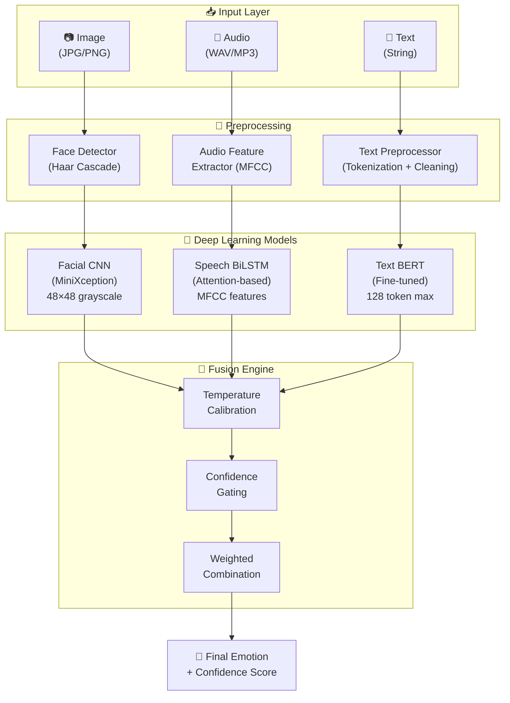

# 🎓 Student's Emotion Recognition using Multimodality and Deep Learning

> An AI-powered system that detects student emotions by analyzing **facial expressions**, **speech signals**, and **text input** simultaneously — then **fuses** all three predictions into a single, reliable emotion output using advanced decision strategies.

---

## 📋 Table of Contents

- [Overview](#-overview)
- [How It Works (Simple Explanation)](#-how-it-works-simple-explanation)
- [System Architecture](#-system-architecture)
- [Model Details](#-model-details)
  - [Facial Emotion Recognition (CNN)](#1-facial-emotion-recognition-cnn)
  - [Speech Emotion Recognition (Attention-BiLSTM)](#2-speech-emotion-recognition-attention-bilstm)
  - [Text Emotion Recognition (BERT)](#3-text-emotion-recognition-bert)
- [Multimodal Fusion Engine](#-multimodal-fusion-engine)
  - [Calibrated Fusion (Default)](#1-calibrated-fusion-default--recommended)
  - [Weighted Fusion](#2-weighted-fusion)
  - [Adaptive Fusion](#3-adaptive-fusion)
  - [Voting Fusion](#4-voting-fusion)
- [Training Parameters](#-training-parameters)
- [Model Performance](#-model-performance)
- [Project Structure](#-project-structure)
- [Getting Started](#-getting-started)
- [Dashboard Guide](#-dashboard-guide)
- [Python API](#-python-api)
- [Datasets](#-datasets)
- [Technology Stack](#-technology-stack)
- [Functional Requirements](#-functional-requirements)
- [Documentation](#-documentation)

---

## 🎯 Overview

This system recognizes **6 emotions** from students:

| Emotion | Example |
|---------|---------|
| 😊 **Happy** | Smiling face, cheerful voice, positive text |
| 😢 **Sad** | Downturned lips, low monotone voice, negative text |
| 😠 **Angry** | Furrowed brows, loud/harsh voice, aggressive text |
| 😐 **Neutral** | Relaxed face, calm voice, factual text |
| 😨 **Fear** | Wide eyes, trembling voice, anxious text |
| 😲 **Surprise** | Raised eyebrows, sudden pitch change, unexpected text |

### Why Multimodal?

A single modality can be misleading. Someone might **smile** while saying something **sarcastic** (text says negative). By combining all three modalities, the system is much more accurate and robust than any single model alone.

---

## 🧠 How It Works (Simple Explanation)

```
┌─────────────┐     ┌──────────────────────┐     ┌─────────────┐
│  📷 Image   │────▶│  Facial CNN Model    │────▶│ "happy 85%" │──┐
└─────────────┘     └──────────────────────┘     └─────────────┘  │
                                                                   │
┌─────────────┐     ┌──────────────────────┐     ┌─────────────┐  │   ┌──────────────┐
│  🎤 Audio   │────▶│  Speech BiLSTM Model │────▶│ "happy 92%" │──┼──▶│  🔀 FUSION   │──▶ Final: HAPPY (89%)
└─────────────┘     └──────────────────────┘     └─────────────┘  │   │    ENGINE    │
                                                                   │   └──────────────┘
┌─────────────┐     ┌──────────────────────┐     ┌─────────────┐  │
│  📝 Text    │────▶│  BERT Text Model     │────▶│ "happy 98%" │──┘
└─────────────┘     └──────────────────────┘     └─────────────┘
```

**Step-by-step:**

1. **Input** — User uploads an image, audio file, and/or enters text
2. **Individual Models** — Each modality's deep learning model independently predicts an emotion
3. **Calibration** — Raw model probabilities are *temperature-scaled* so overconfident models don't dominate
4. **Fusion** — The fusion engine combines all predictions using configurable strategies
5. **Output** — A single final emotion with confidence score and breakdown per modality

---

## 🏗️ System Architecture



---

## 🔬 Model Details

### 1. Facial Emotion Recognition (CNN)

The facial model uses a **MiniXception** architecture — a lightweight CNN designed specifically for real-time emotion detection on small grayscale images.

#### Architecture

```
Input Image (48 × 48 × 1 grayscale)
        │
        ▼
┌─────────────────────────┐
│ Conv2D(8, 3×3) + BN + ReLU    │  ← Entry flow: basic feature extraction
│ Conv2D(8, 3×3) + BN + ReLU    │
└─────────────┬───────────┘
              │
    ┌─────────▼──────────┐
    │  RESIDUAL BLOCK ×4 │  ← 4 blocks with increasing filters
    │                    │
    │  Filters: 16 → 32 → 64 → 128
    │                    │
    │  Each block:       │
    │  ├─ SeparableConv2D(f, 3×3) + BN + ReLU
    │  ├─ SeparableConv2D(f, 3×3) + BN + ReLU
    │  ├─ MaxPool(3×3, stride=2)
    │  └─ + Residual Connection (1×1 conv shortcut)
    └─────────┬──────────┘
              │
              ▼
    Conv2D(6, 3×3)           ← 6 filters = 6 emotion classes
    GlobalAveragePooling2D
    Softmax
              │
              ▼
    Output: [happy, sad, angry, neutral, fear, surprise]
```

#### Key Design Decisions

| Decision | Choice | Why |
|----------|--------|-----|
| **Input size** | 48×48 grayscale | FER2013 standard; keeps model small and fast |
| **Separable convolutions** | Depthwise-separable | 8-9× fewer parameters than regular Conv2D |
| **Residual connections** | Skip connections | Prevents vanishing gradients in deeper blocks |
| **No fully connected layers** | GAP instead | Reduces overfitting, forces spatial learning |
| **Face detection** | Haar Cascade (OpenCV) | Fast, works well for frontal faces |

#### Training Configuration

| Parameter | Value |
|-----------|-------|
| Optimizer | Adam (lr=0.001) |
| Loss | Categorical Crossentropy |
| Batch size | 32 |
| Epochs | 50 |
| Input shape | 48 × 48 × 1 |
| Data split | 15% test, 15% val |

---

### 2. Speech Emotion Recognition (Attention-BiLSTM)

The speech model uses an **Attention-based Bidirectional LSTM** — designed to capture both short-range audio patterns (via CNNs) and long-range temporal dependencies (via BiLSTMs), with an attention mechanism that focuses on the most emotionally relevant parts of the audio.

#### Audio Feature Extraction (Preprocessing)

Before the audio reaches the model, it goes through feature extraction:

```
Raw Audio (.wav) ──▶ librosa ──▶ MFCC Features
                                  │
                    ┌─────────────┼─────────────┐
                    │             │             │
                  MFCC(40)    Delta(40)    Delta²(40)
                    │             │             │
                    └─────────────┼─────────────┘
                                  │
                          Feature Vector
                        (time_steps × 120)
```

| Feature | Count | What It Captures |
|---------|-------|-----------------|
| **MFCC** | 40 coefficients | Spectral envelope (pitch, timbre) |
| **Delta MFCC** | 40 coefficients | Rate of change (intonation shifts) |
| **Delta-Delta MFCC** | 40 coefficients | Acceleration (sudden emotion changes) |
| **Total** | **120 features** per time frame | |

| Audio Parameter | Value |
|----------------|-------|
| Sample rate | 22,050 Hz |
| FFT window | 2,048 samples |
| Hop length | 512 samples |

#### Model Architecture

```
MFCC Input (T × 120)     ← T = time steps, 120 = MFCC + deltas
        │
        ▼
┌──────────────────────────────┐
│  Conv1D(64, k=3) + BN + ReLU     │  ← Short-range feature extraction
│  Conv1D(64, k=3) + BN + ReLU     │
│  MaxPool1D(2) + Dropout(0.2)     │
└──────────────┬───────────────┘
               │
               ▼
┌──────────────────────────────┐
│  Bidirectional LSTM(128)          │  ← Forward + backward temporal patterns
│  Dropout(0.3)                     │
│  Bidirectional LSTM(64)           │  ← Refined temporal encoding
│  Dropout(0.3)                     │
└──────────────┬───────────────┘
               │
               ▼
┌──────────────────────────────┐
│  SELF-ATTENTION LAYER             │  ← Learns which time steps matter most
│  (attention weights over T axis)  │     for emotion classification
└──────────────┬───────────────┘
               │
               ▼
┌──────────────────────────────┐
│  Dense(256) + BN + Dropout(0.4)   │
│  Dense(128) + Dropout(0.3)        │
│  Dense(6, softmax)                │
└──────────────┬───────────────┘
               │
               ▼
    Output: [happy, sad, angry, neutral, fear, surprise]
```

#### How Self-Attention Works (Simple)

The attention mechanism assigns an **importance score** to each time frame of the audio:

```
Time:     [0.1s]  [0.2s]  [0.3s]  [0.4s]  [0.5s]  [0.6s]
Audio:    silence  "I'm"   "so"   "ANGRY"  "at"    "you"
Attention: 0.05    0.10    0.15    0.40     0.15    0.15
                                    ↑
                          Model focuses HERE (loud, emphatic)
```

Instead of treating all time steps equally, the model **focuses** on the most emotionally expressive parts of the speech.

#### Training Configuration

| Parameter | Value |
|-----------|-------|
| Optimizer | Adam (lr=0.001) |
| Loss | Categorical Crossentropy (label smoothing=0.1) |
| Batch size | 32 |
| Epochs | 80 (with EarlyStopping) |
| Label smoothing | 0.1 (prevents overconfidence) |

---

### 3. Text Emotion Recognition (BERT)

The text model uses **BERT** (Bidirectional Encoder Representations from Transformers) — a pre-trained transformer model fine-tuned on emotion classification.

#### How BERT Works (Simple)

Unlike traditional models that read text left-to-right, BERT reads **both directions simultaneously**:

```
Traditional:  "I" → "love" → "this" → "class"  (only sees past words)

BERT:         "I" ← "love" → "this" ← "class"  (sees ALL words at once)
                       ↕              ↕
              Full bidirectional context
```

This means when BERT sees the word "love", it already knows it's followed by "this class" — giving much richer understanding.

#### Architecture

```
Input Text: "I really enjoyed today's lecture!"
        │
        ▼
┌──────────────────────────────┐
│  BERT Tokenizer                   │  ← Converts text to token IDs
│  [CLS] I really enjoyed ...       │     Adds special tokens
│  Max length: 128 tokens           │
└──────────────┬───────────────┘
               │
               ▼
┌──────────────────────────────┐
│  BERT-base-uncased                │  ← 12 transformer layers
│  (110M parameters)                │     768 hidden dimensions
│  Pre-trained on English Wikipedia │     12 attention heads
│  + BookCorpus                     │
└──────────────┬───────────────┘
               │
               ▼
┌──────────────────────────────┐
│  [CLS] Token Embedding            │  ← Represents whole sentence meaning
│                                    │
│  Classification Head:              │
│  Linear(768 → 6) + Softmax        │  ← Maps to 6 emotions
└──────────────┬───────────────┘
               │
               ▼
    Output: [happy, sad, angry, neutral, fear, surprise]
```

#### BERT Parameters

| Parameter | Value |
|-----------|-------|
| Model | `bert-base-uncased` |
| Hidden size | 768 |
| Attention heads | 12 |
| Transformer layers | 12 |
| Total parameters | ~110M |
| Max token length | 128 |
| Optimizer | AdamW (lr=2×10⁻⁵) |
| Batch size | 16 |
| Epochs | 5 |
| Fine-tuned layers | Classifier head + top BERT layers |

#### Temperature Scaling

BERT models tend to be **overconfident** (predicting 99% for one class). Temperature scaling softens the output:

```
Before calibration (T=1.0):  [0.95, 0.01, 0.01, 0.01, 0.01, 0.01]  ← Overconfident!
After calibration  (T=1.2):  [0.78, 0.05, 0.05, 0.04, 0.04, 0.04]  ← More realistic
```

| Temperature | Effect |
|-------------|--------|
| T = 1.0 | No change (raw softmax) |
| T > 1.0 | Softens predictions (reduces overconfidence) |
| T < 1.0 | Sharpens predictions (increases confidence) |

**Our calibration temperatures:**
- Facial: T = 1.5 (most overconfident → soften the most)
- Speech: T = 1.3
- Text: T = 1.2

---

## 🔀 Multimodal Fusion Engine

The fusion engine is the **brain** of the system. It takes independent predictions from each modality and combines them into a single, reliable prediction. The system supports **4 fusion strategies**:

### 1. Calibrated Fusion (Default — Recommended)

This is the most sophisticated strategy. It performs three steps:

```
Step 1: CALIBRATE each modality's probabilities
        (apply temperature scaling to prevent overconfident models from dominating)

Step 2: GATE low-confidence modalities
        (if a modality's confidence < 30%, skip it entirely)

Step 3: WEIGHT & COMBINE
        (multiply calibrated probabilities by confidence-scaled weights, then normalize)
```

**Formula:**

```
effective_weight[m] = base_weight[m] × confidence[m]

fused_probs = Σ (effective_weight[m] × calibrated_probs[m]) / Σ effective_weight[m]
```

**Example:**
```
Facial:  happy=80%, confidence=0.80 → effective weight = 0.40 × 0.80 = 0.32
Speech:  happy=90%, confidence=0.95 → effective weight = 0.30 × 0.95 = 0.285
Text:    happy=20%, confidence=0.25 → SKIPPED (below 30% threshold)

Final = (0.32 × facial_probs + 0.285 × speech_probs) / (0.32 + 0.285)
```

### 2. Weighted Fusion

Simple linear combination with fixed weights:

```
fused = 0.40 × facial + 0.30 × speech + 0.30 × text
```

Pros: Simple, predictable. Cons: Ignores confidence levels.

### 3. Adaptive Fusion

Like weighted fusion, but weights are dynamically adjusted by each modality's confidence:

```
adaptive_weight[m] = base_weight[m] × confidence[m]
fused = Σ (adaptive_weight[m] × probs[m]) / Σ adaptive_weight[m]
```

A modality that is very confident gets amplified; a low-confidence modality gets diminished.

### 4. Voting Fusion

Each modality casts a "vote" for its top predicted emotion. The emotion with the most votes wins:

```
Facial predicts: HAPPY    → +1 vote for HAPPY
Speech predicts: HAPPY    → +1 vote for HAPPY
Text predicts:   NEUTRAL  → +1 vote for NEUTRAL

Result: HAPPY wins (2 vs 1)
```

Pros: Simple, robust to outliers. Cons: Ignores probability magnitudes.

### Fusion Comparison

| Strategy | Uses Calibration | Uses Confidence | Handles Missing Modalities | Best For |
|----------|:---:|:---:|:---:|---------|
| **Calibrated** | ✅ | ✅ | ✅ | Production use (most accurate) |
| **Weighted** | ❌ | ❌ | ✅ | Simple, fast predictions |
| **Adaptive** | ❌ | ✅ | ✅ | Variable-quality inputs |
| **Voting** | ❌ | ❌ | ✅ | Quick consensus |

### Default Modality Weights

| Modality | Weight | Rationale |
|----------|--------|-----------|
| Facial | 0.40 | Strongest visual signal for basic emotions |
| Speech | 0.30 | Captures tone, pitch, and energy |
| Text | 0.30 | Captures semantic meaning and context |

These weights can be adjusted in real-time via the dashboard sidebar sliders.

---

## ⚙️ Training Parameters

### Complete Parameter Reference

| Parameter | Facial | Speech | Text |
|-----------|--------|--------|------|
| **Framework** | TensorFlow/Keras | TensorFlow/Keras | PyTorch (HuggingFace) |
| **Architecture** | MiniXception CNN | Attention-BiLSTM | BERT-base-uncased |
| **Input format** | 48×48×1 grayscale | MFCC time-series | Tokenized text (128 max) |
| **Optimizer** | Adam | Adam | AdamW |
| **Learning rate** | 0.001 | 0.001 | 2×10⁻⁵ |
| **Batch size** | 32 | 32 | 16 |
| **Max epochs** | 50 | 80 | 5 |
| **Early stopping** | ✅ (patience=10) | ✅ (patience=15) | ✅ (best val accuracy) |
| **Loss function** | Categorical CE | Cat. CE + Label Smoothing(0.1) | Cross Entropy |
| **Data split** | 70/15/15 | 70/15/15 | 70/15/15 |
| **Random seed** | 42 | 42 | 42 |

---

## 📊 Model Performance

### Accuracy Results

| Model | Training Accuracy | Validation Accuracy | Dataset |
|-------|:-:|:-:|---------|
| **Facial (CNN)** | ~60% | **57.7%** | FER2013 (35,887 images) |
| **Speech (BiLSTM)** | ~98% | **97.0%** | RAVDESS (1,440 audio files) |
| **Text (BERT)** | ~70% | **65.9%** | GoEmotions (58,000 texts) |

> **Note:** FER2013 is a notoriously difficult dataset — 57.7% is typical for lightweight models. State-of-the-art reaches ~73% with much larger architectures. The speech model achieves 97% because RAVDESS is a controlled, acted dataset with clear emotional expressions.

### Training History Visualizations

Training history plots and confusion matrices are available in the [`docs/`](docs/) directory:
- Facial model: training/validation accuracy curves + confusion matrix
- Speech model: training/validation accuracy curves + confusion matrix

---

## 📁 Project Structure

```
Student's Emotion Recognition using Multimodality and Deep Learning/
│
├── src/                                # 🔧 Source code
│   ├── config.py                       #    Global configuration & hyperparameters
│   ├── facial_recognition/             #    👁️ Facial emotion module
│   │   ├── model_architecture.py       #       CNN architectures (MiniXception, EfficientNet)
│   │   ├── emotion_model.py            #       EmotionCNN wrapper class
│   │   ├── face_detector.py            #       Face detection (Haar Cascade)
│   │   ├── data_preprocessing.py       #       Image augmentation & loading
│   │   └── train.py                    #       Training script
│   ├── speech_analysis/                #    🎤 Speech emotion module
│   │   ├── emotion_model.py            #       Attention-BiLSTM model
│   │   ├── audio_features.py           #       MFCC feature extraction
│   │   ├── speech_recognition.py       #       Audio loading utilities
│   │   └── train.py                    #       Training script
│   ├── text_analysis/                  #    📝 Text emotion module
│   │   ├── emotion_model.py            #       BERT/RoBERTa classifiers + FocalLoss
│   │   ├── text_preprocessing.py       #       Text cleaning & tokenization
│   │   └── train.py                    #       Training script
│   ├── fusion/                         #    🔀 Multimodal fusion module
│   │   ├── multimodal_fusion.py        #       4 fusion strategies + temperature calibration
│   │   └── multimodal_predictor.py     #       High-level prediction API
│   ├── dashboard/                      #    🖥️ Web interface
│   │   ├── app.py                      #       Streamlit dashboard (main UI)
│   │   └── run.py                      #       Dashboard launcher
│   └── utils/                          #    🛠️ Utility functions
│       ├── helpers.py                  #       Common helpers
│       └── voice_recorder.py           #       Audio recording utility
│
├── saved_models/                       # 💾 Trained model weights (gitignored)
│   ├── facial_emotion_model.h5         #    ~43 MB
│   ├── speech_emotion_model.h5         #    ~6 MB
│   └── text_bert_model/                #    ~438 MB (HuggingFace format)
│
├── data/                               # 📦 Datasets (gitignored — download separately)
├── docs/                               # 📚 Documentation + training plots
├── tests/                              # 🧪 Unit tests
├── requirements.txt                    # 📋 Python dependencies
├── run_dashboard.py                    # ▶️ Dashboard launcher script
├── QUICKSTART.md                       # 🚀 Quick start guide
├── DATASET_INSTRUCTIONS.md             # 📥 Dataset download instructions
└── README.md                           # 📖 This file
```

---

## 🚀 Getting Started

### Prerequisites

- **Python** 3.8 or higher
- **pip** package manager
- **~2 GB** disk space (for models + dependencies)
- *(Optional)* CUDA-capable GPU for faster training

### Step 1: Clone the Repository

```bash
git clone https://github.com/srivardhan-kondu/Student-s-Emotion-Recognition-using-Multimodality-and-Deep-Learning.git
cd "Student's Emotion Recognition using Multimodality and Deep Learning"
```

### Step 2: Create Virtual Environment

```bash
python3 -m venv venv
source venv/bin/activate        # macOS/Linux
# venv\Scripts\activate         # Windows
```

### Step 3: Install Dependencies

```bash
pip install -r requirements.txt
python -c "import nltk; nltk.download('punkt'); nltk.download('stopwords'); nltk.download('wordnet')"
```

### Step 4: Download Datasets

| Dataset | Modality | Size | Download Link |
|---------|----------|------|---------------|
| **FER2013** | Facial | ~300 MB | [Kaggle](https://www.kaggle.com/datasets/msambare/fer2013) |
| **RAVDESS** | Speech | ~1.1 GB | [Kaggle](https://www.kaggle.com/datasets/uwrfkaggler/ravdess-emotional-speech-audio) |
| **GoEmotions** | Text | ~50 MB | [Kaggle](https://www.kaggle.com/datasets/debarshichanda/goemotions) |

Place them in the `data/` directory:

```
data/
├── facial/fer2013/          # FER2013 images (train/ and test/ subfolders)
├── speech/ravdess/          # RAVDESS audio files
└── text/goemotions/         # GoEmotions CSV files
```

See [DATASET_INSTRUCTIONS.md](DATASET_INSTRUCTIONS.md) for detailed steps.

### Step 5: Train Models

```bash
# Train facial model (~30 min on CPU, ~5 min on GPU)
python src/facial_recognition/train.py

# Train speech model (~20 min on CPU)
python src/speech_analysis/train.py

# Train text model (~40 min on CPU, ~10 min on GPU)
python src/text_analysis/train.py
```

### Step 6: Launch Dashboard

```bash
python run_dashboard.py
```

Open your browser at **http://localhost:8501** 🎉

---

## 🖥️ Dashboard Guide

The Streamlit dashboard provides 4 tabs:

| Tab | What It Does |
|-----|-------------|
| **🎯 Multimodal** | Upload image + audio + text → fused prediction |
| **👁️ Image** | Upload/capture image → facial emotion only |
| **🎤 Audio** | Upload audio → speech emotion only |
| **📝 Text** | Enter text → text emotion only |

### Sidebar Controls

- **Fusion Strategy** — Switch between Calibrated, Weighted, Adaptive, or Voting
- **Modality Weights** — Adjust facial/speech/text weights with sliders (for Weighted and Adaptive modes)
- **Prediction History** — Shows last 5 predictions

---

## 🐍 Python API

You can use the system programmatically without the dashboard:

```python
from src.fusion.multimodal_predictor import MultimodalEmotionPredictor

# Initialize and load models
predictor = MultimodalEmotionPredictor()
predictor.load_models()

# Single modality predictions
facial_result = predictor.predict_from_image("photo.jpg")
speech_result = predictor.predict_from_audio("speech.wav")
text_result   = predictor.predict_from_text("I'm so happy today!")

# Multimodal prediction (any combination works)
result = predictor.predict_multimodal(
    image_path="photo.jpg",
    audio_path="speech.wav",
    text="I'm so happy today!"
)

print(f"Emotion: {result['emotion']}")
print(f"Confidence: {result['confidence']:.1%}")
print(f"Modalities Used: {result['modalities_used']}/3")

# Access individual modality results
for modality, res in result['individual_results'].items():
    print(f"  {modality}: {res['emotion']} ({res['confidence']:.1%})")
```

---

## 📦 Datasets

### FER2013 (Facial)

| Property | Value |
|----------|-------|
| Total images | 35,887 |
| Image size | 48 × 48 pixels, grayscale |
| Classes | 7 (mapped to our 6 emotions) |
| Source | Facial Expression Recognition challenge |

### RAVDESS (Speech)

| Property | Value |
|----------|-------|
| Total files | 1,440 audio clips |
| Actors | 24 (12 male, 12 female) |
| Format | WAV, 48 kHz |
| Emotions | 8 (mapped to our 6 emotions) |
| Source | Ryerson Audio-Visual Database |

### GoEmotions (Text)

| Property | Value |
|----------|-------|
| Total texts | ~58,000 Reddit comments |
| Classes | 27 fine-grained (mapped to our 6 emotions) |
| Language | English |
| Source | Google Research |

---

## 🛠️ Technology Stack

| Category | Technologies | Purpose |
|----------|-------------|---------|
| **Deep Learning** | TensorFlow 2.x, PyTorch, HuggingFace Transformers | Model training & inference |
| **Computer Vision** | OpenCV, Haar Cascades | Face detection & image processing |
| **Audio Processing** | librosa | MFCC feature extraction |
| **NLP** | NLTK, HuggingFace Tokenizers | Text preprocessing & tokenization |
| **Web Framework** | Streamlit | Interactive dashboard |
| **Visualization** | Matplotlib, Plotly, Seaborn | Training plots & result charts |
| **Data Science** | NumPy, Pandas, scikit-learn | Data manipulation & evaluation |

---

## ✅ Functional Requirements

| ID | Requirement | Status |
|----|-------------|:------:|
| FR1-FR5 | Multi-input support (image, audio, text) | ✅ |
| FR6-FR8 | Facial emotion recognition with face detection | ✅ |
| FR9-FR10 | Speech emotion analysis from audio | ✅ |
| FR11-FR12 | Text emotion analysis using NLP | ✅ |
| FR13-FR14 | Multimodal fusion with adaptive weighting | ✅ |
| FR15-FR17 | Web dashboard with visualization | ✅ |
| FR19-FR20 | Model training and evaluation pipeline | ✅ |
| FR22-FR23 | Comprehensive documentation | ✅ |

---

## 📚 Documentation

| Document | Description |
|----------|-------------|
| [QUICKSTART.md](QUICKSTART.md) | Step-by-step setup guide |
| [DATASET_INSTRUCTIONS.md](DATASET_INSTRUCTIONS.md) | How to download and organize datasets |
| [Technical Documentation](docs/TECHNICAL_DOCUMENTATION.md) | In-depth technical details |
| [User Guide](docs/USER_GUIDE.md) | How to use the dashboard |
| [Deployment Guide](docs/DEPLOYMENT_GUIDE.md) | Production deployment options |

---

## 📄 License

This project is developed as part of an academic research initiative at the university level.

## 🙏 Acknowledgments

- **Datasets:** FER2013, RAVDESS, GoEmotions
- **Pre-trained Models:** BERT (Google), EfficientNet (Google)
- **Libraries:** TensorFlow, PyTorch, HuggingFace, Streamlit, librosa, OpenCV
- **Research Papers:**
  - *"Real-time Convolutional Neural Networks for Emotion and Gender Classification"* — MiniXception architecture
  - *"EfficientNetV2: Smaller Models and Faster Training"* (Tan & Le, 2021)
  - *"BERT: Pre-training of Deep Bidirectional Transformers"* (Devlin et al., 2019)
  - *"Attention Is All You Need"* (Vaswani et al., 2017) — Transformer/attention mechanism
